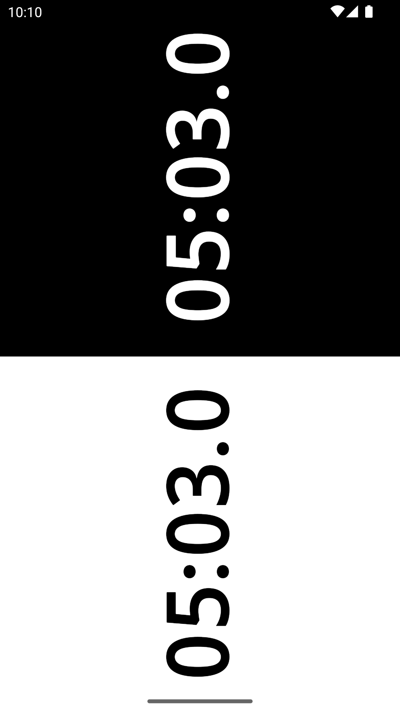

# Blitz

A minimalist [Fischer chess clock](https://en.wikipedia.org/wiki/Fischer_clock) for Android.

The source code is entirely contained in the file [MainActivity.kt](app/src/main/java/net/leodesouza/blitz/MainActivity.kt).

## Features

- Defaults to 5+3 Fischer timing (5 minutes + 3 seconds per move).
- Total time and increment can be set by horizontal and vertical dragging.
- The back action pauses or resets the clock.

## Screenshot

