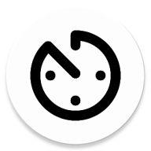

<!-- Copyright 2024 Léo de Souza -->
<!-- SPDX-License-Identifier: Apache-2.0 -->

  

  
  
  

# Blitz: Fischer Chess Clock

A minimalist [Fischer chess clock](https://en.wikipedia.org/wiki/Fischer_clock) for Android.

This app is free software.
Its [source code](https://github.com/ldeso/blitz) is available under the [Apache License 2.0](LICENSES/Apache-2.0.md).

## Features

  - Defaults to 5+3 Fischer timing (5 minutes + 3 seconds per move).
  - Total time and increment can be set by horizontal and vertical dragging.
  - The back action pauses or resets the clock.

## Install

The app can be installed from three different sources:

  1. [GitHub](https://github.com/ldeso/blitz/releases/latest): built and signed by the developer.
  2. [F-Droid](https://f-droid.org/packages/net.leodesouza.blitz/): built and signed by the developer and [verified by F-Droid](https://f-droid.org/docs/Reproducible_Builds/) to correspond to the available source code.
  3. [Play Store](https://play.google.com/store/apps/details?id=net.leodesouza.blitz): built and signed by Google, who is [allowed to modify](https://play.google/play-app-signing-terms/) the app to optimise its performance, security and/or size.

All sources are using the same app signing key, so the app can be updated using a different source to the one it was installed from.
For example, an app installed from F-Droid can be updated to a newer version downloaded from the Play Store.

## About

This is a native Android app that requires no permission and is compatible with Android 5.0+.
It is entirely built with [Jetpack Compose](https://developer.android.com/jetpack/compose) and implements:

  - Predictive back gestures ([Android 14+](https://developer.android.com/about/versions/13/features/predictive-back-gesture))
  - Per-app language preferences ([Android 13+](https://developer.android.com/about/versions/13/features/app-languages))
  - Support for right-to-left languages
  - Precise orientation handling
  - Keyboard navigation

## Links

[License: Apache-2.0](LICENSES/Apache-2.0.md) — [Website](https://blitz.leodesouza.net) — [Issue Tracker](https://github.com/ldeso/blitz/issues) — [Source Code](https://github.com/ldeso/blitz) — [Changelog](CHANGELOG.md) — [Privacy Policy](PRIVACY_POLICY.md)

## Screenshots

  &nbsp;&nbsp;&#8203;
  &nbsp;&nbsp;

